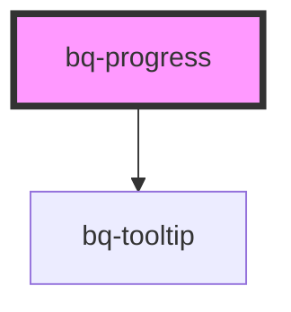

# bq-progress

<!-- Auto Generated Below -->

## Properties

| Property        | Attribute        | Description                                                             | Type                    | Default     |
| --------------- | ---------------- | ----------------------------------------------------------------------- | ----------------------- | ----------- |
| `borderShape`   | `border-shape`   | It will set the border style of the progress bar                        | `"rounded" \| "square"` | `'rounded'` |
| `enableTooltip` | `enable-tooltip` | If `true`, a tooltip will be shown displaying the progress value        | `boolean`               | `false`     |
| `indeterminate` | `indeterminate`  | If `true` the indeterminate state of progress bar is enabled            | `boolean`               | `false`     |
| `label`         | `label`          | If `true`, a label text showing the value (in percentage) will be shown | `boolean`               | `false`     |
| `thickness`     | `thickness`      | Progress bar thickness                                                  | `"large" \| "medium"`   | `'medium'`  |
| `type`          | `type`           | Progress type                                                           | `"default" \| "error"`  | `'default'` |
| `value`         | `value`          | A number representing the current value of the progress bar             | `number`                | `0`         |

## Shadow Parts

| Part         | Description |
| ------------ | ----------- |
| `"label"`    |             |
| `"progress"` |             |
| `"wraper"`   |             |

## Dependencies

### Depends on

- [bq-tooltip](../tooltip)

### Graph

----------------------------------------------

*Built with [StencilJS](https://stenciljs.com/)*
