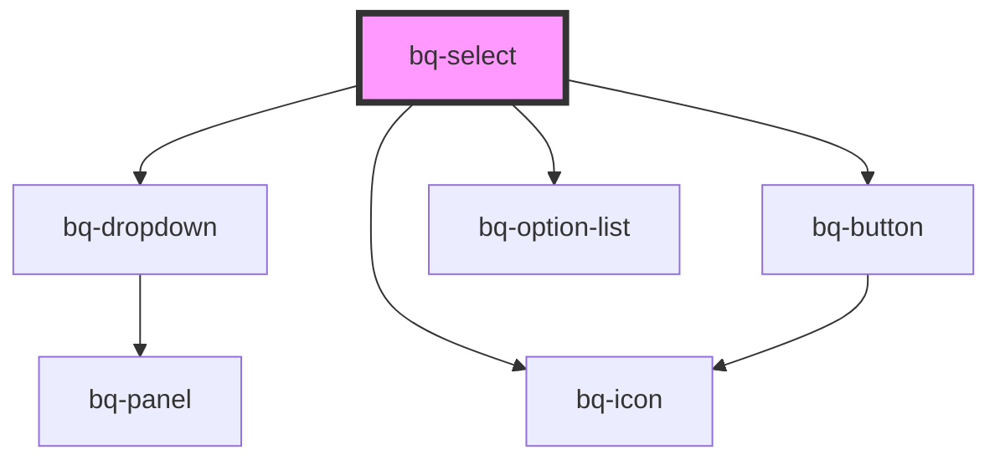

# bq-select

<!-- Auto Generated Below -->

## Properties

| Property            | Attribute             | Description                                                                                                             | Type                                                                                                                                                                 | Default         |
| ------------------- | --------------------- | ----------------------------------------------------------------------------------------------------------------------- | -------------------------------------------------------------------------------------------------------------------------------------------------------------------- | --------------- |
| `autofocus`         | `autofocus`           | If true, the Select input will be focused on component render                                                           | `boolean`                                                                                                                                                            | `undefined`     |
| `clearButtonLabel`  | `clear-button-label`  | The clear button aria label                                                                                             | `string`                                                                                                                                                             | `'Clear value'` |
| `disableClear`      | `disable-clear`       | If true, the clear button won't be displayed                                                                            | `boolean`                                                                                                                                                            | `false`         |
| `disabled`          | `disabled`            | Indicates whether the Select input is disabled or not. If `true`, the Select is disabled and cannot be interacted with. | `boolean`                                                                                                                                                            | `false`         |
| `distance`          | `distance`            | Represents the distance (gutter or margin) between the Select panel and the input element.                              | `number`                                                                                                                                                             | `8`             |
| `form`              | `form`                | The ID of the form that the Select input belongs to.                                                                    | `string`                                                                                                                                                             | `undefined`     |
| `keepOpenOnSelect`  | `keep-open-on-select` | If true, the Select panel will remain open after a selection is made.                                                   | `boolean`                                                                                                                                                            | `false`         |
| `name` _(required)_ | `name`                | The Select input name.                                                                                                  | `string`                                                                                                                                                             | `undefined`     |
| `open`              | `open`                | If true, the Select panel will be visible.                                                                              | `boolean`                                                                                                                                                            | `false`         |
| `panelHeight`       | `panel-height`        | When set, it will override the height of the Select panel.                                                              | `string`                                                                                                                                                             | `undefined`     |
| `placeholder`       | `placeholder`         | The Select input placeholder text value                                                                                 | `string`                                                                                                                                                             | `undefined`     |
| `placement`         | `placement`           | Position of the Select panel                                                                                            | `"bottom" \| "bottom-end" \| "bottom-start" \| "left" \| "left-end" \| "left-start" \| "right" \| "right-end" \| "right-start" \| "top" \| "top-end" \| "top-start"` | `'bottom'`      |
| `readonly`          | `readonly`            | If true, the Select input cannot be modified.                                                                           | `boolean`                                                                                                                                                            | `undefined`     |
| `required`          | `required`            | Indicates whether or not the Select input is required to be filled out before submitting the form.                      | `boolean`                                                                                                                                                            | `undefined`     |
| `sameWidth`         | `same-width`          | Whether the panel should have the Select same width as the input element                                                | `boolean`                                                                                                                                                            | `true`          |
| `skidding`          | `skidding`            | Represents the skidding between the Select panel and the input element.                                                 | `number`                                                                                                                                                             | `0`             |
| `strategy`          | `strategy`            | Defines the strategy to position the Select panel                                                                       | `"absolute" \| "fixed"`                                                                                                                                              | `'fixed'`       |
| `validationStatus`  | `validation-status`   | The validation status of the Select input.                                                                              | `"error" \| "none" \| "success" \| "warning"`                                                                                                                        | `'none'`        |
| `value`             | `value`               | The select input value, it can be used to reset the field to a previous value                                           | `number \| string \| string[]`                                                                                                                                       | `undefined`     |

## Events

| Event      | Description                                                       | Type                                                                               |
| ---------- | ----------------------------------------------------------------- | ---------------------------------------------------------------------------------- |
| `bqBlur`   | Callback handler emitted when the Select input loses focus        | `CustomEvent<HTMLBqSelectElement>`                                                 |
| `bqClear`  | Callback handler emitted when the selected value has been cleared | `CustomEvent<HTMLBqSelectElement>`                                                 |
| `bqFocus`  | Callback handler emitted when the Select input has received focus | `CustomEvent<HTMLBqSelectElement>`                                                 |
| `bqSelect` | Callback handler emitted when the selected value has changed      | `CustomEvent<{ value: string \| number \| string[]; item: HTMLBqOptionElement; }>` |

## Methods

### `clear() => Promise<void>`

Clears the selected value.

#### Returns

Type: `Promise<void>`

## Shadow Parts

| Part            | Description                                                     |
| --------------- | --------------------------------------------------------------- |
| `"base"`        | The component's base wrapper.                                   |
| `"button"`      | The native HTML button used under the hood in the clear button. |
| `"clear-btn"`   | The clear button.                                               |
| `"control"`     | The input control wrapper.                                      |
| `"helper-text"` | The helper text slot container.                                 |
| `"input"`       | The native HTML input element used under the hood.              |
| `"label"`       | The label slot container.                                       |
| `"panel"`       | The select panel container                                      |
| `"prefix"`      | The prefix slot container.                                      |
| `"suffix"`      | The suffix slot container.                                      |

## Dependencies

### Depends on

- [bq-dropdown](../dropdown)
- [bq-button](../button)
- [bq-icon](../icon)
- [bq-option-list](../option-list)

### Graph

----------------------------------------------

*Built with [StencilJS](https://stenciljs.com/)*
