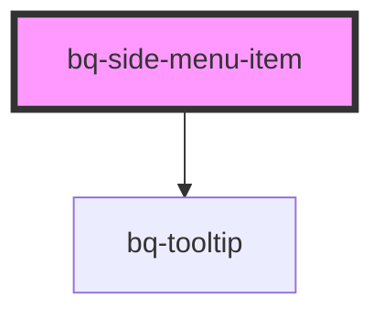

# bq-side-menu-item

<!-- Auto Generated Below -->

## Overview

Represents the default side menu item for standard navigation elements, providing a clean and straightforward way to display menu options.

## Properties

| Property   | Attribute  | Description                                                                                           | Type      | Default |
| ---------- | ---------- | ----------------------------------------------------------------------------------------------------- | --------- | ------- |
| `active`   | `active`   | If true, the menu item will be shown as active/selected.                                              | `boolean` | `false` |
| `collapse` | `collapse` | If true, the item label and suffix will be hidden and the with will be reduce according to its parent | `boolean` | `false` |
| `disabled` | `disabled` | If true, the menu item will be disabled (no interaction allowed)                                      | `boolean` | `false` |

## Events

| Event     | Description                                      | Type                                     |
| --------- | ------------------------------------------------ | ---------------------------------------- |
| `bqBlur`  | Handler to be called when the button loses focus | `CustomEvent<HTMLBqSideMenuItemElement>` |
| `bqClick` | Handler to be called when button gets focus      | `CustomEvent<HTMLBqSideMenuItemElement>` |
| `bqFocus` | Handler to be called when the button is clicked  | `CustomEvent<HTMLBqSideMenuItemElement>` |

## Slots

| Slot                              | Description                   |
| --------------------------------- | ----------------------------- |
| `"The content of the menu item."` |                               |
| `"prefix"`                        | The prefix part of menu item. |
| `"suffix"`                        | The suffix part of menu item. |

## Shadow Parts

| Part        | Description                                                                                                    |
| ----------- | -------------------------------------------------------------------------------------------------------------- |
| `"base"`    | The component wrapper container inside the shadow DOM                                                          |
| `"label"`   | The label slot                                                                                                 |
| `"panel"`   | The `
` container that holds the tooltip content (when the side menu is collapsed)                         |
| `"prefix"`  | The prefix slot                                                                                                |
| `"suffix"`  | The suffix slot                                                                                                |
| `"trigger"` | The `
` container that holds the element which displays tooltip on hover (when the side menu is collapsed) |

## Dependencies

### Depends on

- [bq-tooltip](../tooltip)

### Graph

----------------------------------------------

*Built with [StencilJS](https://stenciljs.com/)*
