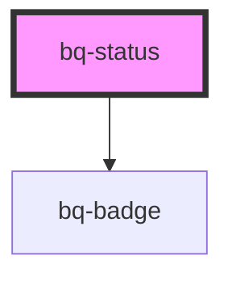

# bq-status

<!-- Auto Generated Below -->

## Properties

| Property | Attribute | Description                              | Type                                                      | Default     |
| -------- | --------- | ---------------------------------------- | --------------------------------------------------------- | ----------- |
| `type`   | `type`    | It defines the type of status to display | `"alert" \| "danger" \| "info" \| "neutral" \| "success"` | `'neutral'` |

## Shadow Parts

| Part       | Description                                                             |
| ---------- | ----------------------------------------------------------------------- |
| `"base"`   | The component's internal wrapper of the status component                |
| `"circle"` | The colored circle that marks the status type                           |
| `"text"`   | The `
` container that holds the text label of the status component |

## Dependencies

### Depends on

- [bq-badge](../badge)

### Graph

----------------------------------------------

*Built with [StencilJS](https://stenciljs.com/)*
