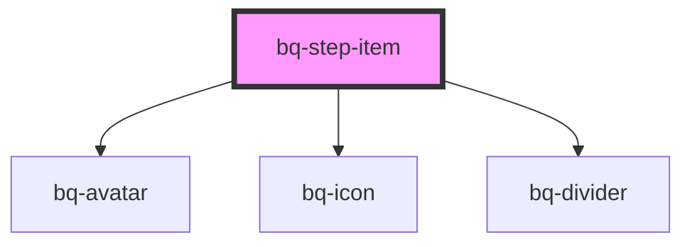

# bq-step-item

<!-- Auto Generated Below -->

## Properties

| Property | Attribute | Description                                          | Type                                                             | Default     |
| -------- | --------- | ---------------------------------------------------- | ---------------------------------------------------------------- | ----------- |
| `isLast` | `is-last` | It defines whether this step item is last in stepper | `boolean`                                                        | `false`     |
| `number` | `number`  | Step number                                          | `number`                                                         | `undefined` |
| `size`   | `size`    | It defines prefix size                               | `"medium" \| "small"`                                            | `'medium'`  |
| `status` | `status`  | It defines step item appearance based on its status  | `"completed" \| "current" \| "default" \| "disabled" \| "error"` | `'default'` |
| `type`   | `type`    | It defines the type of steps                         | `"dot" \| "icon" \| "numeric"`                                   | `'numeric'` |
| `value`  | `value`   | Step value                                           | `string`                                                         | `''`        |

## Events

| Event     | Description | Type                                                             |
| --------- | ----------- | ---------------------------------------------------------------- |
| `bqClick` |             | `CustomEvent<{ target: HTMLBqStepItemElement; value: string; }>` |

## Shadow Parts

| Part            | Description |
| --------------- | ----------- |
| `"base"`        |             |
| `"description"` |             |
| `"title"`       |             |

## Dependencies

### Depends on

- [bq-avatar](../avatar)
- [bq-icon](../icon)
- [bq-divider](../divider)

### Graph

----------------------------------------------

*Built with [StencilJS](https://stenciljs.com/)*
