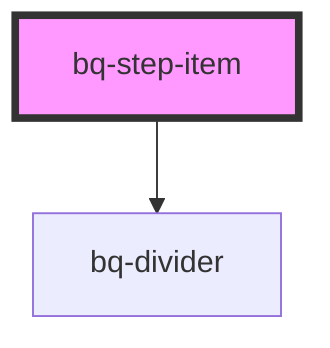

# bq-step-item

<!-- Auto Generated Below -->

## Overview

The Step Item Component is a UI element used to display a single step or stage in a process or task.
It should be used inside the Steps component.

## Properties

| Property       | Attribute       | Description                                                                                  | Type                                                             | Default             |
| -------------- | --------------- | -------------------------------------------------------------------------------------------- | ---------------------------------------------------------------- | ------------------- |
| `dividerColor` | `divider-color` | The color of the line that connects the steps. It should be a valid declarative color token. | `string`                                                         | `'stroke--primary'` |
| `size`         | `size`          | It defines prefix size                                                                       | `"medium" \| "small"`                                            | `'medium'`          |
| `status`       | `status`        | It defines step item appearance based on its status                                          | `"completed" \| "current" \| "default" \| "disabled" \| "error"` | `'default'`         |
| `type`         | `type`          | It defines the step item type used                                                           | `"dot" \| "icon" \| "numeric"`                                   | `undefined`         |

## Events

| Event     | Description                                               | Type                                 |
| --------- | --------------------------------------------------------- | ------------------------------------ |
| `bqBlur`  | Callback handler triggered when the step item loses focus | `CustomEvent<HTMLBqStepItemElement>` |
| `bqClick` | Callback handler triggered when the step item is clicked  | `CustomEvent<HTMLBqStepItemElement>` |
| `bqFocus` | Callback handler triggered when the step item is focused  | `CustomEvent<HTMLBqStepItemElement>` |

## Slots

| Slot            | Description               |
| --------------- | ------------------------- |
|                 | The step item content     |
| `"description"` | The step item description |
| `"prefix"`      | The step item prefix      |

## Shadow Parts

| Part            | Description                   |
| --------------- | ----------------------------- |
| `"base"`        | The component's base wrapper. |
| `"description"` | The component's description.  |
| `"title"`       | The component's title.        |

## Dependencies

### Depends on

- [bq-divider](../divider)

### Graph

----------------------------------------------

*Built with [StencilJS](https://stenciljs.com/)*
