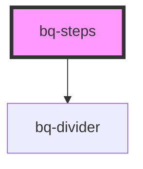

# bq-steps

<!-- Auto Generated Below -->

## Properties

| Property       | Attribute       | Description                                                                                  | Type                           | Default           |
| -------------- | --------------- | -------------------------------------------------------------------------------------------- | ------------------------------ | ----------------- |
| `dividerColor` | `divider-color` | The color of the line that connects the steps. It should be a valid declarative color token. | `string`                       | `'ui--secondary'` |
| `size`         | `size`          | The size of the steps                                                                        | `"medium" \| "small"`          | `'medium'`        |
| `type`         | `type`          | The type of prefix element to use on the step items                                          | `"dot" \| "icon" \| "numeric"` | `undefined`       |

## Events

| Event      | Description                                     | Type                                                             |
| ---------- | ----------------------------------------------- | ---------------------------------------------------------------- |
| `bqChange` | Handler to be called when the tab value changes | `CustomEvent<{ target: HTMLBqStepItemElement; value: string; }>` |

## Shadow Parts

| Part          | Description                                  |
| ------------- | -------------------------------------------- |
| `"container"` | The container wrapper of the Steps component |

## Dependencies

### Depends on

- [bq-divider](../divider)

### Graph

----------------------------------------------

*Built with [StencilJS](https://stenciljs.com/)*
