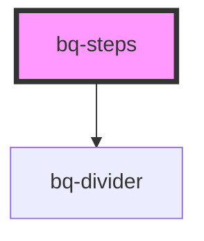

# bq-steps

<!-- Auto Generated Below -->

## Properties

| Property       | Attribute       | Description                                                                                  | Type                           | Default             |
| -------------- | --------------- | -------------------------------------------------------------------------------------------- | ------------------------------ | ------------------- |
| `dividerColor` | `divider-color` | The color of the line that connects the steps. It should be a valid declarative color token. | `string`                       | `'stroke--primary'` |
| `size`         | `size`          | The size of the steps                                                                        | `"medium" \| "small"`          | `'medium'`          |
| `type`         | `type`          | The type of prefix element to use on the step items                                          | `"dot" \| "icon" \| "numeric"` | `undefined`         |

## Shadow Parts

| Part                   | Description                                     |
| ---------------------- | ----------------------------------------------- |
| `"container"`          | The container wrapper of the Steps component    |
| `"divider-base"`       | The base wrapper of the divider component       |
| `"divider-dash-end"`   | The dash end wrapper of the divider component   |
| `"divider-dash-start"` | The dash start wrapper of the divider component |

## Dependencies

### Depends on

- [bq-divider](../divider)

### Graph

----------------------------------------------

*Built with [StencilJS](https://stenciljs.com/)*
