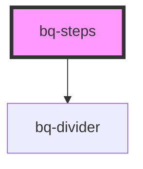

# bq-steps

<!-- Auto Generated Below -->

## Properties

| Property | Attribute | Description                  | Type                           | Default     |
| -------- | --------- | ---------------------------- | ------------------------------ | ----------- |
| `size`   | `size`    |                              | `"medium" \| "small"`          | `'medium'`  |
| `type`   | `type`    | It defines the type of steps | `"dot" \| "icon" \| "numeric"` | `'numeric'` |

## Events

| Event      | Description                                     | Type                                                             |
| ---------- | ----------------------------------------------- | ---------------------------------------------------------------- |
| `bqChange` | Handler to be called when the tab value changes | `CustomEvent<{ target: HTMLBqStepItemElement; value: string; }>` |

## Shadow Parts

| Part          | Description |
| ------------- | ----------- |
| `"container"` |             |

## Dependencies

### Depends on

- [bq-divider](../divider)

### Graph

----------------------------------------------

*Built with [StencilJS](https://stenciljs.com/)*
