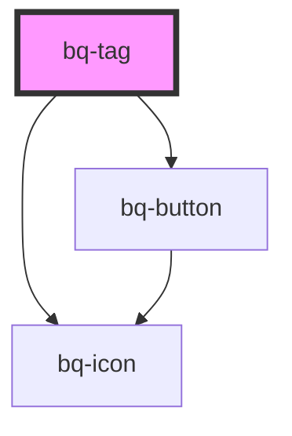

# bq-tag

<!-- Auto Generated Below -->

## Properties

| Property    | Attribute   | Description                                                                            | Type                                                    | Default     |
| ----------- | ----------- | -------------------------------------------------------------------------------------- | ------------------------------------------------------- | ----------- |
| `clickable` | `clickable` | If true, the Tag can be clickable                                                      | `boolean`                                               | `false`     |
| `color`     | `color`     | The color style of the Tag                                                             | `"error" \| "gray" \| "info" \| "success" \| "warning"` | `undefined` |
| `disabled`  | `disabled`  | If true, the Tag will be disabled (only if clickable = `true`, no interaction allowed) | `boolean`                                               | `false`     |
| `hidden`    | `hidden`    | If true, the Tag component will hidden (only if removable = `true`)                    | `boolean`                                               | `undefined` |
| `removable` | `removable` | If true, the Tag component can be removed                                              | `boolean`                                               | `false`     |
| `selected`  | `selected`  | If true, the Tag is selected (only if clickable = `true`)                              | `boolean`                                               | `false`     |
| `size`      | `size`      | The size of the Tag component                                                          | `"medium" \| "small" \| "xsmall"`                       | `'medium'`  |
| `variant`   | `variant`   | The variant of Tag to apply on top of the variant                                      | `"filled" \| "outline"`                                 | `'filled'`  |

## Events

| Event     | Description                                                  | Type                            |
| --------- | ------------------------------------------------------------ | ------------------------------- |
| `bqClick` | Handler to be called when tag is clicked                     | `CustomEvent<HTMLBqTagElement>` |
| `bqClose` | Callback handler to be called when the tag is close/hidden   | `CustomEvent<any>`              |
| `bqFocus` | Handler to be called when tag is focused                     | `CustomEvent<HTMLBqTagElement>` |
| `bqOpen`  | Callback handler to be called when the tag is not open/shown | `CustomEvent<any>`              |

## Methods

### `hide() => Promise<void>`

Method to be called to remove the tag component

#### Returns

Type: `Promise<void>`

### `show() => Promise<void>`

Method to be called to show the tag component

#### Returns

Type: `Promise<void>`

## Shadow Parts

| Part          | Description                                                                                |
| ------------- | ------------------------------------------------------------------------------------------ |
| `"btn-close"` |                                                                                            |
| `"prefix"`    | The `` tag element that acts as prefix container (when icon exists in front of tag). |
| `"text"`      | The `
` element containing the text of the tag component.                              |
| `"wrapper"`   | The wrapper container `
` of the element inside the shadow DOM.                        |

## Dependencies

### Depends on

- [bq-button](../button)
- [bq-icon](../icon)

### Graph

----------------------------------------------

*Built with [StencilJS](https://stenciljs.com/)*
