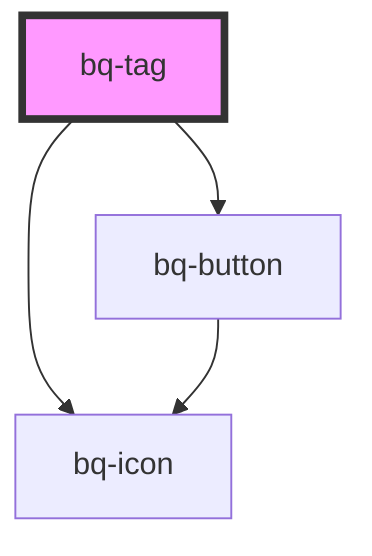

# bq-tag

<!-- Auto Generated Below -->

## Properties

| Property      | Attribute      | Description                              | Type                                   | Default     |
| ------------- | -------------- | ---------------------------------------- | -------------------------------------- | ----------- |
| `hasIcon`     | `has-icon`     | If true, the tag component has an icon   | `boolean`                              | `undefined` |
| `isRemovable` | `is-removable` | If true, the tag component can be closed | `boolean`                              | `undefined` |
| `size`        | `size`         | The type of the tag component            | `"extra_small" \| "medium" \| "small"` | `'small'`   |

## Shadow Parts

| Part          | Description |
| ------------- | ----------- |
| `"btn-close"` |             |
| `"icon"`      |             |
| `"wrapper"`   |             |

## Dependencies

### Depends on

- [bq-icon](../icon)
- [bq-button](../button)

### Graph

----------------------------------------------

*Built with [StencilJS](https://stenciljs.com/)*
