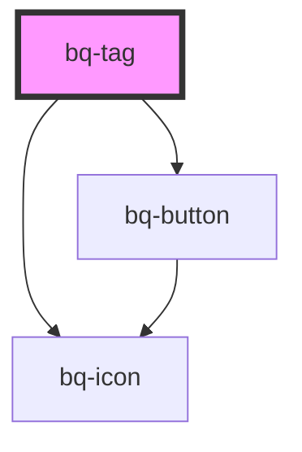

# bq-tag

<!-- Auto Generated Below -->

## Properties

| Property      | Attribute      | Description                                                   | Type                                                       | Default     |
| ------------- | -------------- | ------------------------------------------------------------- | ---------------------------------------------------------- | ----------- |
| `disabled`    | `disabled`     | If true, the button will be disabled (no interaction allowed) | `boolean`                                                  | `false`     |
| `hasColor`    | `has-color`    | If true, the tag component has color style                    | `boolean`                                                  | `undefined` |
| `hasIcon`     | `has-icon`     | If true, the tag component has an icon                        | `boolean`                                                  | `undefined` |
| `isRemovable` | `is-removable` | If true, the tag component can be removed                     | `boolean`                                                  | `undefined` |
| `open`        | `open`         | If true, the tag component will be shown                      | `boolean`                                                  | `undefined` |
| `size`        | `size`         | The type of the tag component                                 | `"extra_small" \| "medium" \| "small"`                     | `'small'`   |
| `type`        | `type`         | The default type of the tag component                         | `"default" \| "error" \| "info" \| "success" \| "warning"` | `'default'` |
| `variant`     | `variant`      | The variant of tag to apply on top of the variant             | `string`                                                   | `'default'` |

## Events

| Event    | Description                                                 | Type               |
| -------- | ----------------------------------------------------------- | ------------------ |
| `bqHide` | Callback handler to be called when the tag is removable     | `CustomEvent<any>` |
| `bqShow` | Callback handler to be called when the tag is not removable | `CustomEvent<any>` |

## Methods

### `hide() => Promise<void>`

Method to be called to remove the tag component

#### Returns

Type: `Promise<void>`

### `show() => Promise<void>`

Method to be called to show the alert component

#### Returns

Type: `Promise<void>`

## Shadow Parts

| Part          | Description |
| ------------- | ----------- |
| `"btn-close"` |             |
| `"icon"`      |             |
| `"wrapper"`   |             |

## Dependencies

### Depends on

- [bq-icon](../icon)
- [bq-button](../button)

### Graph

----------------------------------------------

*Built with [StencilJS](https://stenciljs.com/)*
