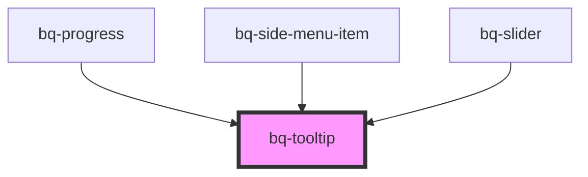

# pk-tooltip

<!-- Auto Generated Below -->

## Overview

The Tooltip component is a small pop-up box that appears when a user hovers over or clicks on an element, providing additional information or context.

## Properties

| Property        | Attribute        | Description                                                                                                                          | Type                                                                                                                                                                 | Default   |
| --------------- | ---------------- | ------------------------------------------------------------------------------------------------------------------------------------ | -------------------------------------------------------------------------------------------------------------------------------------------------------------------- | --------- |
| `alwaysVisible` | `always-visible` | If true, the tooltip will always be visible                                                                                          | `boolean`                                                                                                                                                            | `false`   |
| `displayOn`     | `display-on`     | Set the action when the tooltip should be displayed, on hover (default) or click                                                     | `"click" \| "hover"`                                                                                                                                                 | `'hover'` |
| `distance`      | `distance`       | Distance between trigger element and tooltip                                                                                         | `number`                                                                                                                                                             | `10`      |
| `hideArrow`     | `hide-arrow`     | If true, the arrow on the tooltip content won't be shown                                                                             | `boolean`                                                                                                                                                            | `false`   |
| `placement`     | `placement`      |                                                                                                                                      | `"bottom" \| "bottom-end" \| "bottom-start" \| "left" \| "left-end" \| "left-start" \| "right" \| "right-end" \| "right-start" \| "top" \| "top-end" \| "top-start"` | `'top'`   |
| `sameWidth`     | `same-width`     | Whether the tooltip should have the same width as the trigger element (applicable only for content shorter than the trigger element) | `boolean`                                                                                                                                                            | `false`   |
| `visible`       | `visible`        | Indicates whether or not the tooltip is visible when the component is first rendered, and when interacting with the trigger          | `boolean`                                                                                                                                                            | `false`   |

## Methods

### `hide() => Promise<void>`

Hides the tooltip

#### Returns

Type: `Promise<void>`

### `show() => Promise<void>`

Shows the tooltip

#### Returns

Type: `Promise<void>`

## Slots

| Slot        | Description                                 |
| ----------- | ------------------------------------------- |
|             | The tooltip content                         |
| `"trigger"` | The element which displays tooltip on hover |

## Shadow Parts

| Part        | Description                                                                  |
| ----------- | ---------------------------------------------------------------------------- |
| `"base"`    | The component wrapper container inside the shadow DOM                        |
| `"panel"`   | The `
` container that holds the tooltip content                         |
| `"trigger"` | The `
` container that holds the element which displays tooltip on hover |

## Dependencies

### Used by

 - [bq-progress](../progress)
 - [bq-side-menu-item](../side-menu-item)
 - [bq-slider](../slider)

### Graph

----------------------------------------------

*Built with [StencilJS](https://stenciljs.com/)*
